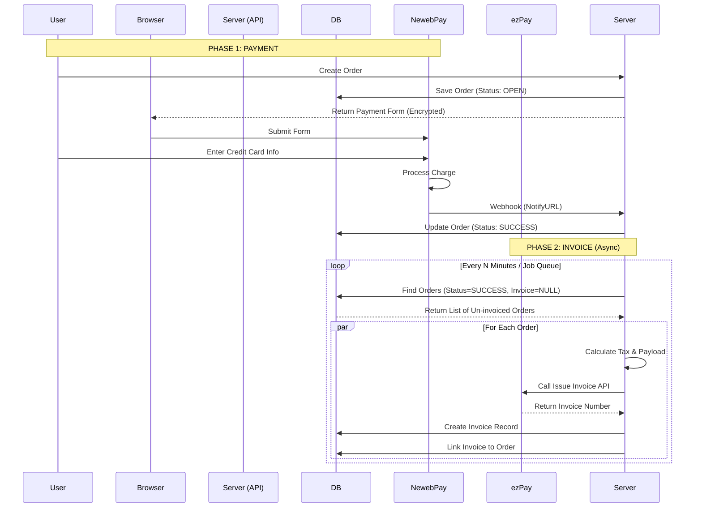

# NewebPay Payment Implementation Guide

This guide details how to implement the NewebPay (藍新金流) MPG (Multi-Payment Gateway) system in a new project. It covers the core flow, encryption logic, and callback handling.

## 1. System Requirements & Configuration

You will need the following credentials from the NewebPay Merchant Admin panel:

- **MerchantID**: Your store ID.
- **HashKey**: Used for AES encryption and SHA hash.
- **HashIV**: Used for AES encryption and SHA hash.
- **API URL**:
  - Production: `https://core.newebpay.com/MPG/mpg_gateway`
  - Test: `https://ccore.newebpay.com/MPG/mpg_gateway`

## 2. Payment Flow Overview

1.  **Create Order (Server)**: Your server generates a unique order number.
2.  **Generate Payload (Server)**:
    - Construct the trade parameters (Amount, ItemDesc, Email, etc.).
    - **Encrypt** the parameters into `TradeInfo`.
    - **Hash** the encrypted data into `TradeSha`.
3.  **Form Submission (Client)**: The server returns the raw HTML form data or the calculated values. The client (browser) must `POST` this form to the NewebPay API URL.
4.  **Payment Processing (NewebPay)**: User completes payment on NewebPay's domain.
5.  **Notification (Server)**: NewebPay sends a `POST` request to your configured `NotifyURL` with the payment results.
6.  **Validation (Server)**: Your server decrypts the payload and updates the order status.

## 3. Step-by-Step Implementation

### Phase 1: Requesting Payment

#### Required Parameters

Key fields to include in your trade object before encryption:

- `MerchantID`: Your Merchant ID.
- `RespondType`: `JSON` or `String`.
- `TimeStamp`: Unix timestamp (seconds).
- `Version`: API Version (e.g., `2.0`).
- `MerchantOrderNo`: Unique order ID.
- `Amt`: Transaction Amount (Int).
- `ItemDesc`: Description of the item.
- `Email`: Payer's email.
- `ReturnURL`: URL to redirect user after success.
- `NotifyURL`: API endpoint for backend webhook (Must be public).
- `ClientBackURL`: "Back to Store" button link.

#### Encryption Logic (AES-CBC)

NewebPay requires specific padding and encryption.

**Utility Functions (TypeScript/Node.js)**:

```typescript
import { ModeOfOperation, utils } from 'aes-js'
import { createHash } from 'crypto'

// 1. PKCS7 Padding
function padding(str: string): string {
  const len = str.length
  const pad = 32 - (len % 32)
  str += String.fromCharCode(pad).repeat(pad)
  return str
}

// 2. Encryption (AES-CBC)
function aesEncrypt(key: string, iv: string, data: string): string {
  const cbc = new ModeOfOperation.cbc(Buffer.from(key), Buffer.from(iv))
  return utils.hex.fromBytes(cbc.encrypt(utils.utf8.toBytes(padding(data))))
}

// 3. Generate TradeInfo
// Convert your data object to a query string before encrypting
function genTradeInfo(
  key: string,
  iv: string,
  data: Record<string, any>,
): string {
  const searchParams = new URLSearchParams(data)
  return aesEncrypt(key, iv, searchParams.toString())
}
```

#### Checksum Logic (SHA256)

A SHA256 hash is required to verify the integrity of the data.

```typescript
function genTradeSha(key: string, iv: string, tradeInfo: string): string {
  const str = `HashKey=${key}&${tradeInfo}&HashIV=${iv}`
  return createHash('sha256').update(str).digest('hex').toUpperCase()
}
```

#### Final Form Construction

Your frontend needs to submit a form like this:

```html
<form action="https://core.newebpay.com/MPG/mpg_gateway" method="post">
  <input type="hidden" name="MerchantID" value="..." />
  <input type="hidden" name="TradeInfo" value="[Encrypted String]" />
  <input type="hidden" name="TradeSha" value="[SHA256 Hash]" />
  <input type="hidden" name="Version" value="2.0" />
  <button type="submit">Pay</button>
</form>
```

---

### Phase 2: Handling Notifications (NotifyURL)

NewebPay will `POST` data to your `NotifyURL`. The body will generally contain:

- `MerchantID`
- `TradeInfo` (Encrypted result)
- `TradeSha`

#### Decryption Logic

```typescript
function stripPadding(str: string): string {
  const padCheck = new RegExp(
    str.slice(-1) + '{' + str.slice(-1).charCodeAt(0) + '}',
  )
  return padCheck.test(str) ? str.replace(padCheck, '') : str
}

function decrypt(key: string, iv: string, tradeInfo: string): any {
  const cbc = new ModeOfOperation.cbc(Buffer.from(key), Buffer.from(iv))

  // 1. Decrypt Hex
  const decryptedBytes = cbc.decrypt(utils.hex.toBytes(tradeInfo))

  // 2. Convert to UTF8 and Strip Padding
  const decryptedStr = stripPadding(utils.utf8.fromBytes(decryptedBytes))

  // 3. Parse JSON (NewebPay returns JSON inside the string if RespondType=JSON)
  try {
    return JSON.parse(decryptedStr)
  } catch (e) {
    return decryptedStr // Or handle query string format
  }
}
```

#### Verification Steps

1.  **Check Status**: `decryptedData.Status === 'SUCCESS'`.
2.  **Verify Amount**: Ensure `decryptedData.Amt` matches your database record.
3.  **Check Order**: Match `decryptedData.MerchantOrderNo` with your system.
4.  **Idempotency**: Ensure this order hasn't already been processed (NewebPay might retry notifications).
5.  **Response**: Return HTTP 200 to acknowledge receipt.

## Summary of Critical Helpers

To successfully integrate, you need to implement these three core functions in your new project:

1.  `encrypt(data)`: For generating the request.
2.  `hash(tradeInfo)`: For signing the request.
3.  `decrypt(tradeInfo)`: For reading the response.

_Dependencies used in examples: `aes-js`, `crypto`._

# ezPay Electronic Invoice Implementation Guide

This guide details how to implement the ezPay (簡單付) Electronic Invoice system. Unlike the payment flow which involves the client browser, the invoice generation is a direct **server-to-server** API call.

## 1. System Requirements & Configuration

You will need a separate set of credentials for the Invoice system (different from the Payment system):

- **MerchantID**: Your Invoice Merchant ID.
- **HashKey**: Used for AES-256 encryption.
- **HashIV**: Used for AES-256 encryption.
- **API URL**:
  - Production: `https://inv.ezpay.com.tw/Api/invoice_issue`
  - Test: `https://cinv.ezpay.com.tw/Api/invoice_issue`

## 2. Invoice Flow Overview

1.  **Trigger (Server)**: An invoice is typically triggered _after_ a successful payment or via a scheduled task.
2.  **Generate Payload (Server)**:
    - Construct invoice parameters (Buyer info, Items, Amounts, Tax).
    - **Encrypt** the parameter object into a URL-encoded query string, then AES-256 encrypt it to get `PostData_`.
3.  **API Request (Server)**: Send a JSON POST request directly to the ezPay API.
4.  **Synchronous Response (Server)**: ezPay returns a JSON response immediately containing the invoice details (encrypted) or error message.
5.  **Validation (Server)**: Decrypt the response and verify the checksum to ensure data integrity.

## 3. Step-by-Step Implementation

### Phase 1: Requesting Invoice Issuance

#### Required Parameters

Key fields to include in your invoice object (`PostData` source):

- `RespondType`: `JSON`.
- `Version`: `1.5`.
- `TimeStamp`: Unix timestamp (seconds).
- `MerchantOrderNo`: Unique order ID.
- `Status`: `1` (Immediate issue).
- `Category`: `B2C` or `B2B`.
- `BuyerName`: Buyer's name.
- `BuyerEmail`: Buyer's email.
- `PrintFlag`: `Y` (Yes) or `N` (No).
- `TaxType`: `1` (Taxable), `2` (Zero-tax), `3` (Tax-free).
- `TaxRate`: `5` (5%).
- `Amt`: Sales amount (excluding tax).
- `TaxAmt`: Tax amount.
- `TotalAmt`: Total amount (Amt + TaxAmt).
- `ItemName`: Product name(s), separated by `|`.
- `ItemCount`: Quantity, separated by `|`.
- `ItemUnit`: Unit (e.g., "pc"), separated by `|`.
- `ItemPrice`: Unit price, separated by `|`.
- `ItemAmt`: Total price per item, separated by `|`.

#### Encryption Logic (AES-256-CBC)

The invoice system uses **AES-256-CBC**. Note that this differs slightly from the payment system in key length/handling.

**Utility Functions (Node.js `crypto`)**:

```typescript
import { createCipheriv, createDecipheriv, createHash } from 'crypto'
import { stringify } from 'querystring'

// 1. Encryption (AES-256-CBC)
// Key and IV must be Buffer or string (utf-8)
function encryptAES256(data: string, key: string, iv: string): string {
  const cipher = createCipheriv(
    'aes-256-cbc',
    Buffer.from(key),
    Buffer.from(iv),
  )
  // Default parsing of data is utf-8, output is hex
  const encrypted = Buffer.concat([cipher.update(data), cipher.final()])
  return encrypted.toString('hex').toLowerCase()
}

// 2. Prepare PostData
// Convert object to query string FIRST, then encrypt
function genPostData(
  data: Record<string, any>,
  key: string,
  iv: string,
): string {
  const queryString = stringify(data) // e.g. "Amt=100&Version=1.5..."
  return encryptAES256(queryString, key, iv)
}
```

#### Request Construction

Your server sends a POST request with new form-urlencoded or JSON body:

```typescript
// Payload structure
const payload = {
  MerchantID_: 'YOUR_MERCHANT_ID',
  PostData_: 'AES_ENCRYPTED_HEX_STRING',
}

// Send via axios or fetch
const response = await axios.post(
  'https://cinv.ezpay.com.tw/Api/invoice_issue',
  stringify(payload),
)
```

---

### Phase 2: Handling the Response

The API returns a JSON object. You must parse `result.Result` which contains the encrypted invoice data.

#### Response Structure

```json
{
  "Status": "SUCCESS",
  "Message": "...",
  "Result": "{ \"MerchantID\": \"...\", \"CheckCode\": \"...\" }"
}
```

_Note: The `Result` field is a JSON string that you must parse first._

#### Decryption & Validation Logic

1.  **Generate Local CheckCode**: You must calculate the CheckCode yourself using the returned data fields to verify the response is authentic.
2.  **Decrypt**: If specific details are needed from an encrypted block (sometimes returns mainly cleartext in Result, but detailed info needs decryption if provided via webhook or specific endpoints).

**Note**: In the Invoice Issue API V1.5, the immediate response `Result` string often contains cleartext fields like `InvoiceNumber`, `RandomNum`, etc., along with a `CheckCode`. You verify the `CheckCode`.

**CheckCode Generation (SHA256)**:

```typescript
function generateCheckCode(
  params: Record<string, string>, // Extract specific fields: MerchantID, MerchantOrderNo, InvoiceTransNo, TotalAmt, RandomNum
  key: string,
  iv: string,
): string {
  // 1. Sort absolute keys alphabetically
  const sortedKeys = Object.keys(params).sort()
  const sortedObj: Record<string, string> = {}
  sortedKeys.forEach((k) => (sortedObj[k] = params[k]))

  // 2. Convert to query string
  const checkStr = stringify(sortedObj)

  // 3. Wrap with HashIV and HashKey
  const strToHash = `HashIV=${iv}&${checkStr}&HashKey=${key}`

  // 4. SHA256 Hash -> UpperCase
  return createHash('sha256').update(strToHash).digest('hex').toUpperCase()
}
```

#### Final Verification Steps

1.  Parse `response.data.Result`.
2.  Construct the object for CheckCode using: `MerchantID`, `MerchantOrderNo`, `InvoiceTransNo`, `TotalAmt`, `RandomNum`.
3.  Calculate your own CheckCode.
4.  Compare with `Result.CheckCode`.
5.  If valid, save `Result.InvoiceNumber` and `Result.RandomNum` to your database.

```typescript
// Verification Example
const result = JSON.parse(apiResponse.data.Result)

const myCheckCode = generateCheckCode(
  {
    MerchantID: result.MerchantID,
    MerchantOrderNo: result.MerchantOrderNo,
    InvoiceTransNo: result.InvoiceTransNo,
    TotalAmt: result.TotalAmt,
    RandomNum: result.RandomNum,
  },
  HASH_IV,
  HASH_KEY,
)

if (result.CheckCode !== myCheckCode) {
  throw new Error('Invalid Invoice CheckCode')
}
// Success
console.log('Invoice Created:', result.InvoiceNumber)
```

# Complete Payment & Invoice Integration Flow

This document outlines the end-to-end lifecycle connecting the **Payment System (NewebPay)** and the **Electronic Invoice System (ezPay)**.

While these are two separate APIs service providers, they are linked together in your application logic through the **Order Status**.

## High-Level Sequence

1.  **Payment Phase**: User pays for an order via NewebPay.
2.  **State Change**: System confirms payment and marks Order as `SUCCESS`.
3.  **Invoice Phase**: An asynchronous background task detects the successful order and issues an invoice via ezPay.

---

## Detailed Workflow

### Phase 1: Payment (Synchronous + Callback)

This phase ensures the company receives the money.

1.  **User Checkout**:
    - User selects an item/service and clicks "Pay".
    - **Server**: Creates an `Order` record with status `PENDING`.
    - **Server**: Encrypts trade details (Amount, MerchantID, etc.) using NewebPay keys.
    - **Server**: Returns an HTML Form to the browser.
2.  **Payment Gate**:
    - **Browser**: Auto-submits the form to NewebPay (`mpg_gateway`).
    - **User**: Enters credit card/payment info on NewebPay's secure page.
3.  **Completion & Notification**:
    - **NewebPay**: Charges the user.
    - **NewebPay**: Sends a background HTTP POST (Webhook) to your server's `NotifyURL`.
    - **Server**: Decrypts the payload.
    - **Server**: Verifies the CheckCode/amount.
    - **Server**: **Updates `Order` status to `SUCCESS`.** (This is the trigger for Phase 2).

### Phase 2: The "Bridge" (Decoupling)

There is no direct code call from `PaymentService` to `InvoiceService`. Instead, they are decoupled via the database state.

- **Trigger Condition**: An `Order` exists where:
  1.  `Status` is `SUCCESS`.
  2.  `InvoiceID` is `NULL` (No invoice created yet).
  3.  (Optional) Start/End time criteria are met.

### Phase 3: Invoice Issuance (Asynchronous Task)

This phase ensures the user receives their tax invoice. This is handled by `CreateInvocieTaskProcessor`.

1.  **Job Selection**:
    - The background processor (likely running on a schedule or queue) queries the database.
    - **Query**: `SELECTAll` orders matching the Trigger Condition above.
2.  **Invoice Generation**:
    - For each order, the processor calculates tax (Amt vs TaxAmt).
    - **Server**: Prepares the Invoice DTO (`BuyerName`, `TaxType`, `ItemList`).
    - **Server**: Encrypts data using ezPay keys (Note: These keys are different from NewebPay keys).
3.  **API Execution**:
    - **Server**: Sends a direct POST request to ezPay (`invoice_issue`).
    - **ezPay**: Generates the invoice immediately and returns the `InvoiceNumber` and `RandomNum`.
4.  **Finalization**:
    - **Server**: Creates an `Invoice` entity in the database.
    - **Server**: Links the `Invoice` to the `Order`.
    - **Server**: Saves changes.
    - _Result_: Order now has an invoice, so it won't be picked up by the job again.

---

## Data Flow Diagram



## Key Configuration Check

To ensure this flow works, you must have:

1.  **Store Settings**:
    - `isUseInvoice`: `true`
    - `invoiceMerchantId`: Set correctly.
    - `invoiceHashIV`: Set correctly.
    - `invoiceHashKey`: Set correctly.
2.  **Processor Status**:
    - The `CreateInvocieTaskProcessor` must be running/scheduled.

import axios from 'axios';
import {
createCipheriv,
createDecipheriv,
createHash,
randomBytes,
} from 'crypto';
import { stringify } from 'querystring';

/_ -------------------------------------------------------------------------- _/
/_ 1. MOCK DATABASE _/
/_ -------------------------------------------------------------------------- _/
const DB = {
orders: [] as any[],
invoices: [] as any[],

// Store Config (Company B)
store: {
merchantId: 'PAY_M_123',
hashKey: 'PAY_KEY_1234567890123456789012',
hashIV: 'PAY_IV_123456789',

    invoiceMerchantId: 'INV_M_999',
    invoiceHashKey: 'INV_KEY_9999999999999999999999',
    invoiceHashIV: 'INV_IV_999999999',

},
};

/_ -------------------------------------------------------------------------- _/
/_ 2. UTILS (Simulated) _/
/_ -------------------------------------------------------------------------- _/
const encrypt = (data: any, key: string, iv: string) => {
// Simple mock encryption to show flow
return `ENCRYPTED[${JSON.stringify(data)}]`;
};

/_ -------------------------------------------------------------------------- _/
/_ PART A: PAYMENT FLOW (NewebPay) _/
/_ -------------------------------------------------------------------------- _/

// 1. Customer A clicks "Buy"
async function step1*createOrder(amount: number) {
// 1. Order Data (Enhanced for Invoice Requirements)
const order = {
id: 'ORD*' + Date.now(),
amount: amount,
status: 'PENDING',
invoiceId: null,
// Required for Invoice:
items: [{ name: 'Standard Green Fee', count: 1, unitPrice: amount }],
buyer: { name: 'Customer A', email: 'customer@example.com' },
};
DB.orders.push(order);
console.log('1. [Server] Order Created:', order);

// 2. Server generates Payment Form Data
const paymentData = {
MerchantID: DB.store.merchantId,
Amt: amount,
MerchantOrderNo: order.id,
NotifyURL: 'https://myserver.com/callback',
};

const tradeInfo = encrypt(paymentData, DB.store.hashKey, DB.store.hashIV);

console.log(
'2. [Server] Returned Payment Form to Browser with TradeInfo:',
tradeInfo,
);
/\*
[CLIENT SIDE ACTION EXPLAINED]
The server sends back an HTML page with a hidden form:
<form action="https://core.newebpay.com/MPG/mpg_gateway" method="POST">
<input type="hidden" name="TradeInfo" value="...">
...
</form>
<script>document.forms[0].submit()</script>

     The user is immediately redirected to NewebPay to enter credit card info.

\*/
return order.id;
}

// 3. NewebPay sends Webhook (Simulated)
async function step2_receivePaymentCallback(orderId: string) {
console.log('3. [NewebPay] User paid! Sending Webhook...');

// Find order
const order = DB.orders.find((o) => o.id === orderId);
if (order) {
order.status = 'SUCCESS'; // Payment Successful!
console.log('4. [Server] Order Status Updated to SUCCESS');
}
}

/_ -------------------------------------------------------------------------- _/
/_ PART B: INVOICE FLOW (ezPay) _/
/_ -------------------------------------------------------------------------- _/

// 4. Background Job (The "Bridge")
async function step3_invoiceJob() {
console.log('5. [Background Job] Checking for uninvoiced orders...');

// FIND Rule: Status=SUCCESS AND Invoice=NULL
const ordersToInvoice = DB.orders.filter(
(o) => o.status === 'SUCCESS' && !o.invoiceId,
);

for (const order of ordersToInvoice) {
await createInvoiceForOrder(order);
}
}

async function createInvoiceForOrder(order: any) {
// A. Prepare Payload
// Tax Logic: Taiwan VAT is standard 5% (1.05).
// We back-calculate from the Gross Total.
const taxRate = 1.05;
const price = Math.round(order.amount / taxRate);
const tax = order.amount - price;

const invoiceData = {
MerchantID*: DB.store.invoiceMerchantId,
PostData*: encrypt(
{
RespondType: 'JSON',
Version: '1.5',
MerchantOrderNo: order.id,
Amt: price,
TaxAmt: tax,
TotalAmt: order.amount,
BuyerName: 'Customer A',
PrintFlag: 'Y',
},
DB.store.invoiceHashKey,
DB.store.invoiceHashIV,
), // <--- DIFFERENT KEYS
};

console.log('6. [Server] Calling ezPay API with payload:', invoiceData);

// B. Call API (Mocked)
// const response = await axios.post('https://cinv.ezpay.com.tw/Api/invoice_issue', stringify(invoiceData));
const mockResponse = {
Status: 'SUCCESS',
Result: JSON.stringify({
InvoiceNumber: 'AB12345678',
RandomNum: '9999',
TotalAmt: order.amount,
}),
};

// C. Handle Response
const result = JSON.parse(mockResponse.Result);

// D. Save to DB
const invoice = {
id: 'INV\_' + Date.now(),
number: result.InvoiceNumber,
orderId: order.id,
};
DB.invoices.push(invoice);

// E. Link to Order
order.invoiceId = invoice.id;
console.log('7. [Server] Invoice Created & Linked:', result.InvoiceNumber);
}

/_ -------------------------------------------------------------------------- _/
/_ RUN SIMULATION _/
/_ -------------------------------------------------------------------------- _/
(async () => {
console.log('--- START SIMULATION ---');

// 1. Buy
const orderId = await step1_createOrder(1050); // Buy $1050 item

// 2. Pay
await step2_receivePaymentCallback(orderId);

// 3. Invoice Job (Runs periodically)
await step3_invoiceJob();

console.log('--- FINAL DB STATE ---');
console.log(JSON.stringify(DB, null, 2));
})();
